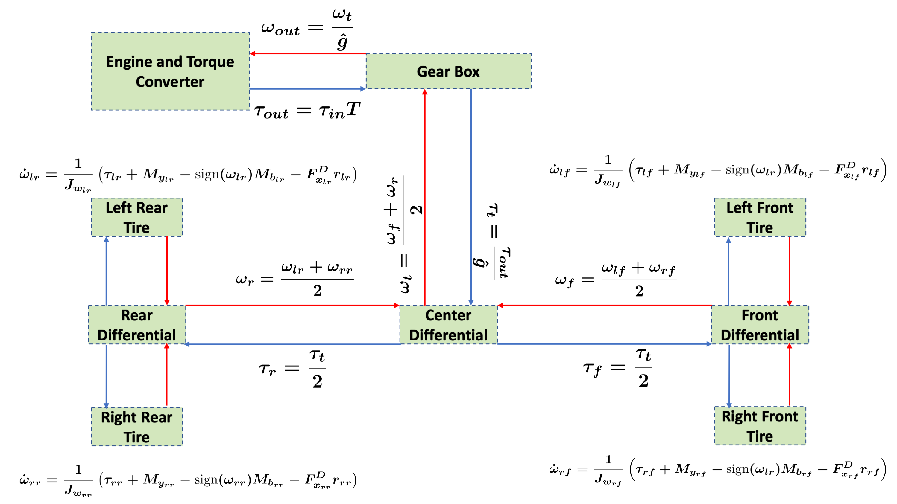
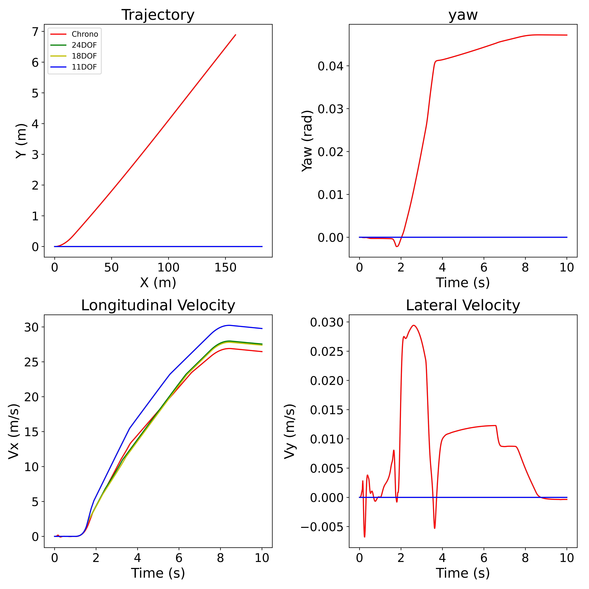
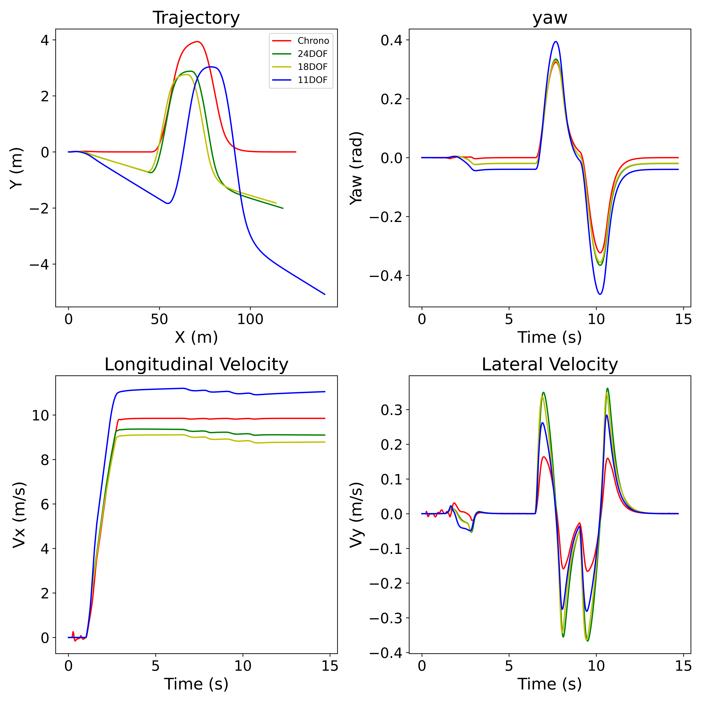
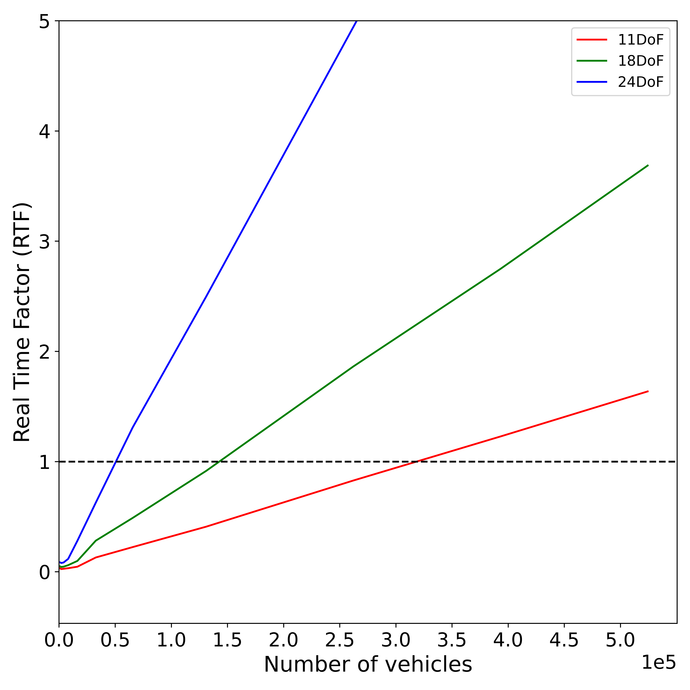

# Summary
Lower Fidelity Dynamic Models (LFDM) is a library of on-road wheeled-vehicle dynamics models written in C++ and Cuda and wrapped to Python using SWIG. Each of these on-road wheeled-vehicle dynamics models are described as Ordinary Differential Equations (ODEs) that take a driver input - a normalized throttle between 0 and 1, a normalized steering between -1 and 1 with -1 representing a left turn, and a normalized braking input between 0 and 1 and map the vehicle state (its position, velocity etc.) at the current time step to the vehicle state at the next time step. 
In mathematical connotation, these ODEs are of second order and are written as
\begin{equation}
\mathbf{\"x} = f(\mathbf{x},\mathbf{\dot{x}}, \mathbf{u}, \mathbf{P})
\end{equation}
Where $\mathbf{x} \in \mathbb{R}^d$ are the $d$ dimensional states of the vehicle, $\mathbf{u} \in \mathbb{R}^3$ are the driver inputs and $\mathbf{P} \in \mathbb{R}^k$ and the $k$ dimensional model parameters. These ODEs representing the vehicle dynamics models are cast as Initial Value Problems (IVPs) by provided an initial state $\mathbf{x}$ and are solved using implicit and semi-implicit numerical methods. 
LFDM is a collection of three such sets of ODEs: an 11 Degree of Freedom (DoF), an 18 DoF and a 24 DoF. Each of these models are available on CPUs and Nvidia GPUs and vary from one another in terms of fidelity level.  

The 11 DoF model is a single-track vehicle model with 2 wheels and is commonly used in controller design and serves as the entry point to the LFDMs. The Chassis is modelled as a rigid body and includes 3 DoFs at the vehicle lumped Center of Mass (C.M), representing the vehicle’s yaw, lateral, and longitudinal motions. In addition, the model hosts a kinematic drive line that transmits torques from a map-based engine model, through a map-based torque converter, gear box and differential onto the two wheels and the wheel velocities back through the drive line to the engine. The wheels host one of the two available versions of the non-linear TMeasy tire model [@Rill:2013] which produce the traction-forces that move the vehicle. A steering map is used to map the normalized steering wheel inputs to front wheel angle. 

The 18 DoF model is a double-track vehicle model with 4 wheels with the Chassis now also having a roll DoF in addition to the lateral, longitudinal and yaw DoFs. It hosts a similar drive line to the 11 DoF model except for additional front and rear differentials that split torque between the left and right wheels in the front and rear respectively (See Fig. \autoref{fig:driveline}). Additionally, the steering map for the 18 DoF maps the normalized steering wheel input to both the right and left front wheels equally. All the other vehicle subsystems are consistent between the 18 DoF and 11 DoF models.

{ width=80% }

| Symbol | Description                                    |
|--------|------------------------------------------------|
| $J_{in}$ | Motor input shaft inertia ($kg \cdot m^2$) |
| $T$      | Torque Ratio (-)                              |
| $\hat{g}$ | Current gear ratio (-)                       |
| $T$      | Torque Ratio (-)                              |
| $\eta$   | Differential split (-)                        |  

The 24 DoF model, which considers the suspension at each corner, offers the same benefits as the 18 DoF model, but it can also predict vehicle heave and pitch motions. The Chassis thus has all 6 DoFs - lateral, longitudinal, vertical, yaw, roll and pitch. The model also has 1 additional DoF at the four corners of the vehicle for vertical suspension travel. All the other subsystems of the 24 DoF model are the same as that of the 18 DoF model.  

The overarching goal of these models is to provide open-source, accurate yet expeditious vehicle models that run much faster than real-time, making them suitable for applications in state-estimation, control, reinforcement learning and traffic simulations. In Section [LFDM Accuracy](#LFDM-Accuracy) we show the accuracy comparision of the LFDMs to a High-Fidelity Vehicle Model, Chrono::Vehicle[@Serban:2019]. Then, in [LFDM Speed and Scaling](#LFDM-Speed-and-Scaling) we show that the LFDMs, which are close in accuracy to Chrono::Vehicle, are also about 1000 times faster. In addition, we show that by using the GPU version of the models, one can simualate about 300,000 vehicles in real-time, i.e. simulating one second of the dynamics of 300,000 vehicles takes one real second. Additional details about the model formulation can be found in Chapter two of [@huzaifa:2023].

# Statement of need
In applications such as state-estimation, control, reinforcement learning and traffic simulations, vehicle models need to be much faster than real-time while maintaining an acceptable level of accuracy. The library of LFDMs strives to provide easy to use and accesible vehicle models that meet this trade-off, fast but still acurate. For these applications, several vehicle models have been discussed and investigated in the literature [@Pepy:2006;@Kong:2015;@Jin:2019]. The models discussed here are largely inspired from existing vehicle models in literature but provide several additional benefits that fit the needs of vehicle models for faster than real-time applications:  

1. Models currently used in literature are usually simplistic single-track models with linear tires or fully kinematic models. The choice for using these models usually comes down to the speed-accuracy trade-off where simple, less accurate models are used for the benefit of computational speed. [@Liu:2016] showed that although a double-track vehicle model with non-linear tires is more accurate than a simplisic single-track model with linear tires, it is not used in the Control stack as it runs with a Real Time Factor (RTF) of 1, which is not fast enough. The library of LFDMs, through efficient C++ code, provides double-track vehicle models with accurate non-linear tires along with realistic subsystems for the driveline, engine and torque converters, at a simulation speed that is much faster than real-time.  

2. The vehicle models presented in existing literature are seldom associated with open-source code and documentation for other reasearches to pick up and use for their applications. Even if open-source code is available, models with different fidelities are spread out across various different repositories. The library of LFDMs offers a single source where researches can experiment with vehicle models of varying fidelity levels and pick the one which meets the speed-accuracy trade-off on their hardware.  

3. To the best of our knowledge, their exists no open-source software that supports large-scale parallel simulation of on-road vehicle dynamics on the GPU.LFDMs enables the simulation of close to 300,000 vehicles in real-time, enabling large-scale reinforcement learning and traffic simulations.  

4. Most vehicle models in literature are implemented as IVPs and solved using explicit solvers. It is however well known that explicit solvers are unstable for highly non-linear and stiff ODEs [@Ascher:1998]. Thus, with the library of LFDMs, we also provide two stable solvers: (i) a semi-implicit solver with constant time-stepping and real-time guarentees and (ii) an implicit solver with adaptive time-stepping through Sundials [@Hindmarsh:2005]. Although the Sundials solver does not provide gaurentees on simulation speed (due to its adaptive time-stepping nature) and cannot be used for faster than real-time simulation, it provides stable solutions and enables Forward Sensivitiy Analysis (FSA) features. Additionally, both solvers also provide system RHS Jacobians $\frac{\partial f}{\partial \mathbf{x}}$ and $\frac{\partial f}{\partial \mathbf{u}}$ which are useful in gradient based Model Predictive Control (MPC) methods.  

5. Commercial tools such as MSC Adams and MATLAB offer varying fidelity vehicle models with benchmarks. However, these tools are closed source and do not offer ways to incorporate these models in control stacks without having to use the same tool.  

# LFDM Accuracy
To show the accuracy of the LFDMs, we generate ground-truth data using a high-fidelity Vehicle Dynamics simulator, Chrono::Vehicle. We first calibrate each of the LFDMs using a Bayesian Inference framework [@Unjhawala:2023] to yield a proxy for a Sedan with dimensions similar to an Audi A5 and modeled with Chrono::Vehicle. Five different throttle and steering maneuvers are chosen to calibrate the LFDMs with the Sedan. In each of these maneuvers, different amounts of throttle are applied, and the Sedan is steered left or right. The different throttle amounts result in vehicle accelerations at speeds ranging from 30 km/h to 65 km/h, enabling the calibration of parameters for turns of various speeds. The Engine maps and the steering map are calibrated. Once the LFDMs are calibrated, they are tested in two scenarios: 1. A high speed acceleration maneuver at 90 km/h and 2. A double lane change maneuver at a speed 40 km/h. The Chrono data for the double lane change maneuver is obtained by using a PID controller to follow a ISO 3888-2 standard double lane change trajectory. For both the experiments, the same control inputs that are applied to the Sedan are applied to the LFDMs. Fig.\autoref{fig:acc} and \autoref{fig:dl} show that the 24 DoF and 18 DoF model best capture the dyanmics of the Sedan with the 11 DoF model, which is the one commonly used in control applications, not performing as well. Additionally, for the straight line acceleration test, we see that the Chrono::Vehicle Sedan has a non-zero yaw and lateral velocity due to the engine reaction torque acting on the Chassis. This is not the case for the LFDMs as it does not capture intricate physics. The models have also been compared for accuracy to different Chrono vehicle types such as the heavy-duty US Army High Mobility Multipurpose Wheeled Vehicle (HMMWV) in Chapter 5 of [@huzaifa:2023].

{ width=80% }

{ width=80% }

# LFDM Speed and Scaling
To show that the LFDMs are not just accurate but also fast, we benchmark each of the LFDMs against Chrono::Vehicle. We perform a 10-second acceleration maneuver on the LFDMs and Chrono::Vehicle and compute the Real Time Factor (RTF) which is given by the amount of real time required to simulate dynamics for 1 second. Chrono::Vehicle and each of the LFDMs are simulated at a time step of $1e-3$ with the LFDMs using the semi-implicit integrator and Chrono::Vehicle using the default Differential Algebraic Equation (DAE) solver. The table below shows that each of the models in C++ are atleast 2000 times faster than real-time when built with O3 optimization and run on a 13th Gen Intel(R) Core(TM) i7-13700K.

| Model            | Simulation time (ms) | Run time (ms) | RTF  | $1/RTF$ |
|------------------|----------------------|---------------|------|---------|
| Chrono::Vehicle | 10,000 | $5134.29 \pm 72$ | $5.1e^{-1}$ | 2 |
| 24 DoF | 10,000 | $3.67 \pm 0.0003$ | $3.6e^{-3}$ | 2720 |
| 18 DoF | 10,000 | $2.6 \pm 0.0006$ | $2.6e^{-3}$ | 3835 |
| 11 DoF | 10,000 | $1.5 \pm 0.0002$ | $1.5e^{-3}$ | 6461 |

The GPU version of the LFDMs can further enable large scale parallel simulation, useful for applications in Reinforcement Learning (RL) and traffic simulations. Fig. \autoref{fig:gpu_scale}, shows about 330,000 11DoF vehicle models can be simulation on an Nvidia A100 GPU with a RTF of 1.

{ width=60% }

# Acknowledgements
This work has been partially supported by NSF projects FW-HTF-R2222541 and CMMI2153855.

# References